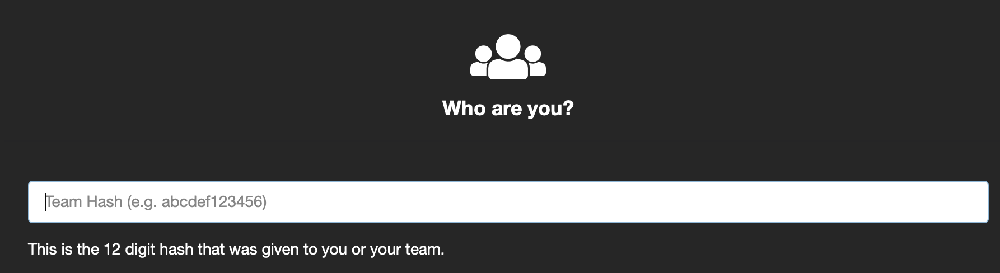
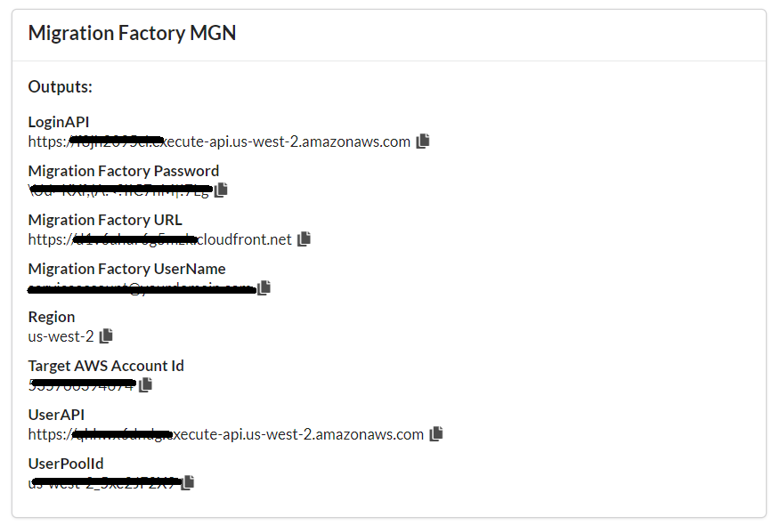
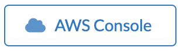

+++
title = "Connect to Event Engine"
weight = 12
+++

## The following steps should be executed to connect to EventEngine.

**1.** Open you browser and navigate to the following URL:

[https://dashboard.eventengine.run](https://dashboard.eventengine.run)

**2.** Insert the hash token provided by the AWS employee

**3.** The output screen contains all the credentials and information that you will need to execute this lab. Bellow is a sample screenshot

> 📝 **Note:** Clicking on the file icon will copy the information to the clipboard.

**4.** Click on **AWS Console**

**5.** Click on **Open AWS Console**

**6.** You are now you are connected to the AWS Console.
> 📝 **Note:** If you are using EventEngine, please move forward to the next page.