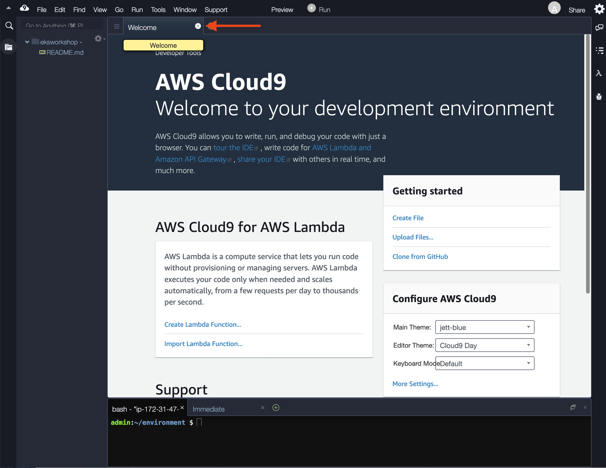
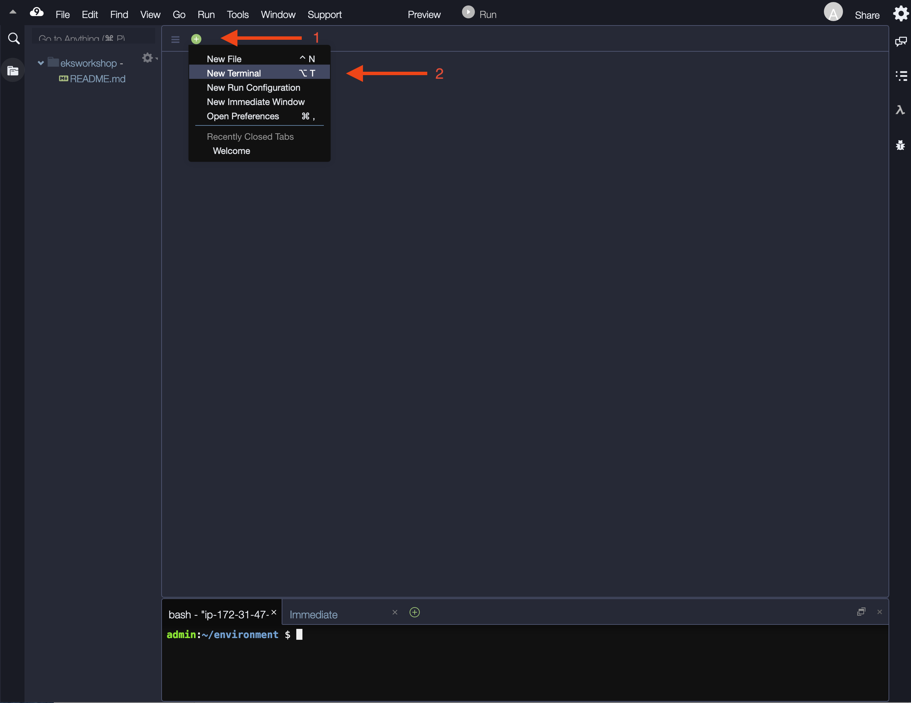
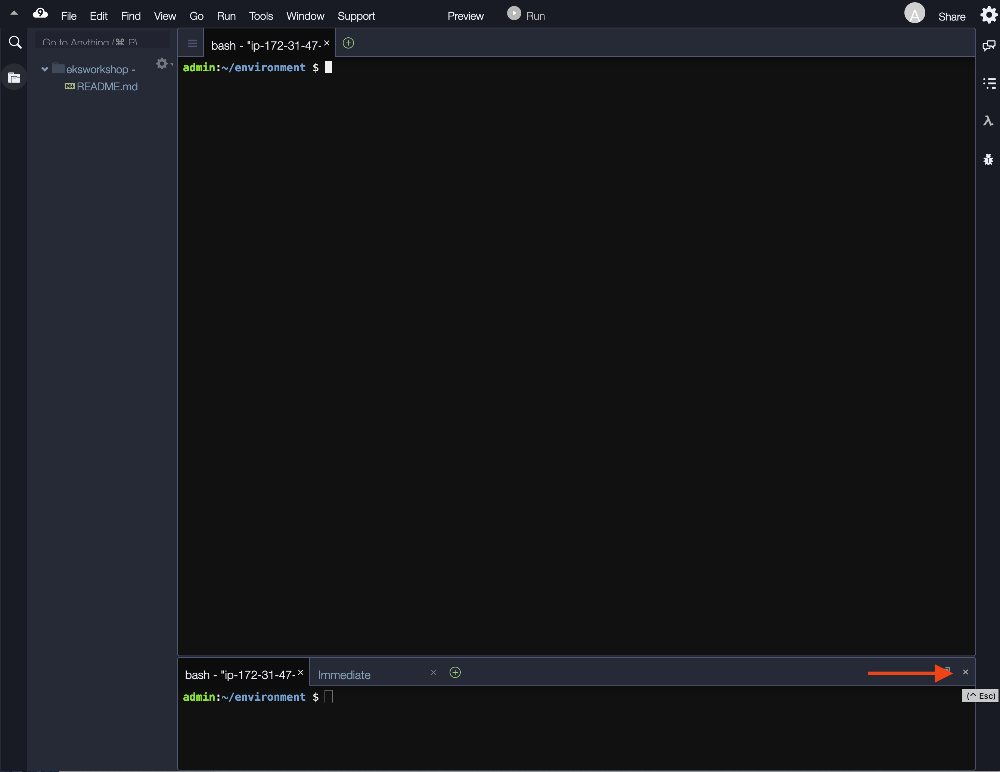

{}
A list of supported browsers for AWS Cloud9 is found [here]( https://docs.aws.amazon.com/cloud9/latest/user-guide/browsers.html).
{}

{}
Ad blockers, javascript disablers, and tracking blockers should be disabled for
the cloud9 domain, or connecting to the workspace might be impacted.
Cloud9 requires third-party-cookies. You can whitelist the [specific domains]( https://docs.aws.amazon.com/cloud9/latest/user-guide/troubleshooting.html#troubleshooting-env-loading).
{}

### Launch Cloud9 in the region selected previously

Navigate to the [Cloud9 console](https://console.aws.amazon.com/cloud9).

- Select **Create environment**
- Name it **MovingUpTheStackWorkshop**, click **Next step**.
- Since we only need to access our Cloud9 environment via web browser, please select the **Create a new no-ingress EC2 instance for environment (access via Systems Manager)** under the Environment Type.
- Choose **t3.small** for instance type, go through the wizard with the default values and click **Create environment**

When it comes up, customize the environment by:

- Closing the **Welcome tab**
  
- Opening a new **terminal** tab in the main work area
  
- Closing the lower work area
  
- Your workspace should now look like this
  

### Update tools and dependencies

{}
The instructions in this workshop assume you are using a bash shell in a linux-like environment. They also rely on a number of tools. Follow these instructions to install the required tools in a cloud9 workspace:
{}

Copy/Paste the following code in your cloud9 terminal (you can paste the whole block at once).

```bash
cat <<EOF >> ~/.bashrc
export AWS_DEFAULT_REGION=$(curl -s 169.254.169.254/latest/dynamic/instance-identity/document | jq -r '.region')
export ACCOUNT_ID=`aws sts get-caller-identity --query Account --output text`
EOF
source ~/.bashrc
sudo yum update -y
sudo yum -y install jq gettext bash-completion moreutils

# Upgrade AWS CLI
curl "https://awscli.amazonaws.com/awscli-exe-linux-x86_64.zip" -o "awscliv2.zip"
unzip awscliv2.zip
sudo ./aws/install

npm install -g c9
curl "https://s3.amazonaws.com/session-manager-downloads/plugin/latest/linux_64bit/session-manager-plugin.rpm" -o "session-manager-plugin.rpm"
sudo yum install -y session-manager-plugin.rpm
```
