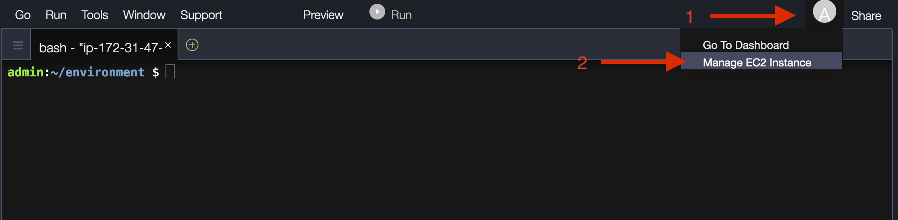
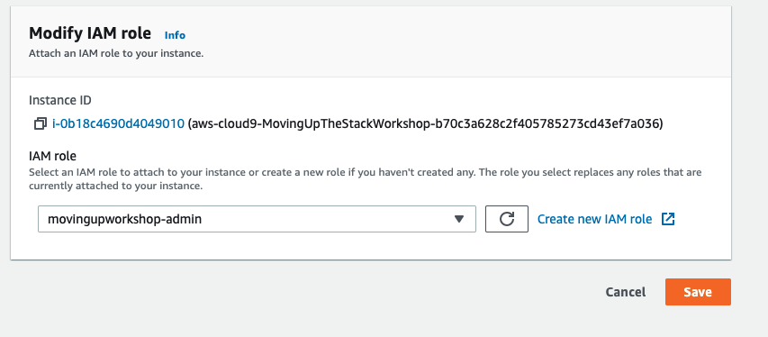

1. Follow [this deep link to create an IAM role with Administrator access](https://console.aws.amazon.com/iam/home#/roles$new?step=review&commonUseCase=EC2%2BEC2&selectedUseCase=EC2&policies=arn:aws:iam::aws:policy%2FAdministratorAccess&roleName=movingupworkshop-admin).
1. Confirm that **AWS service** and **EC2** are selected, then click **Next: Permissions** to view permissions.
1. Confirm that **AdministratorAccess** is checked, then click **Next: Tags** to assign tags.
1. Take the defaults, and click **Next: Review** to review.
1. Enter **movingupworkshop-admin** for the Name, and click **Create role**.


1. Click the grey circle button (in top right corner) and select **Manage EC2 Instance**.

1. Select the instance, then choose **Actions / Security / Modify IAM Role**


1. Choose **movingupworkshop-admin** from the **IAM Role** drop-down, and select **Save**


- Return to your Cloud9 workspace and click the gear icon (in top right corner)
- Select **AWS SETTINGS**
- Turn off **AWS managed temporary credentials**
- Close the Preferences tab


To ensure temporary credentials aren't already in place we will also remove
any existing credentials file:

```sh
rm -vf ${HOME}/.aws/credentials
```