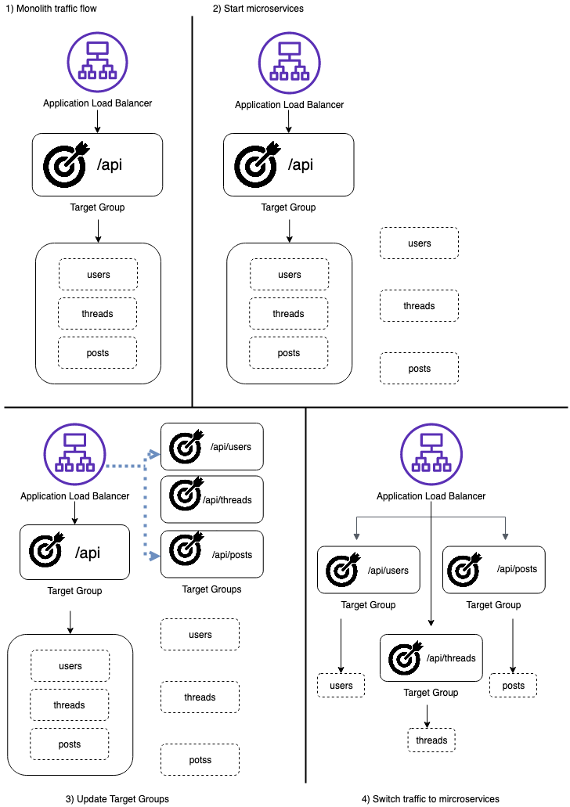
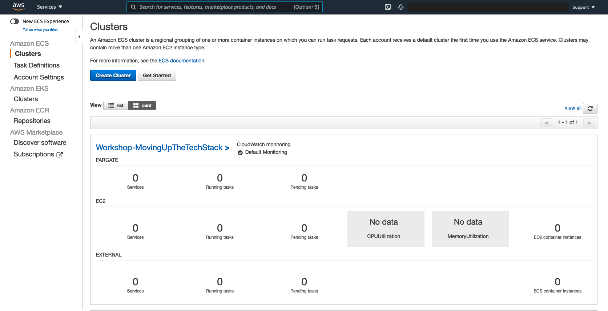
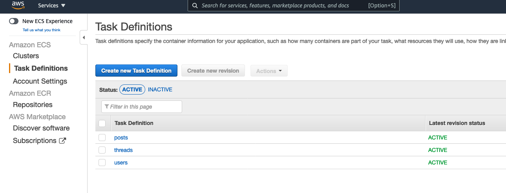
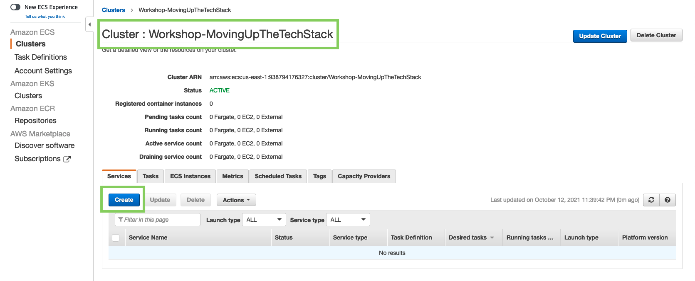
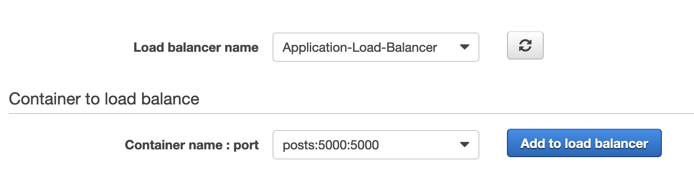
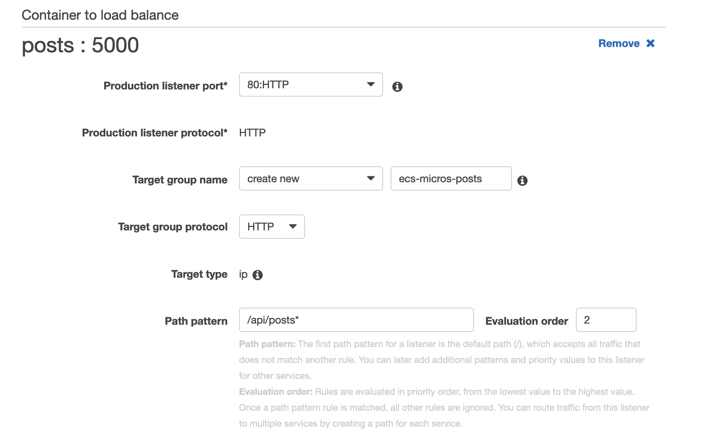
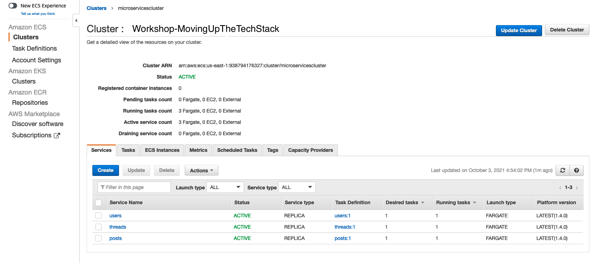
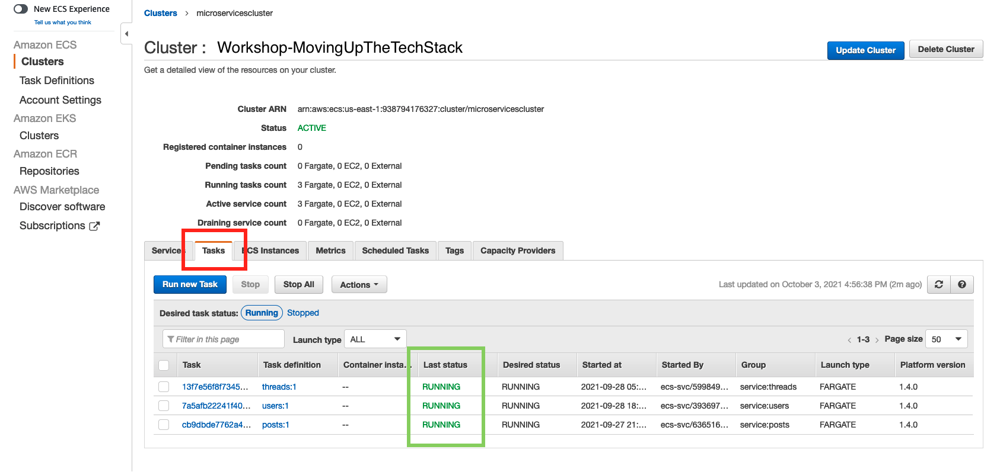
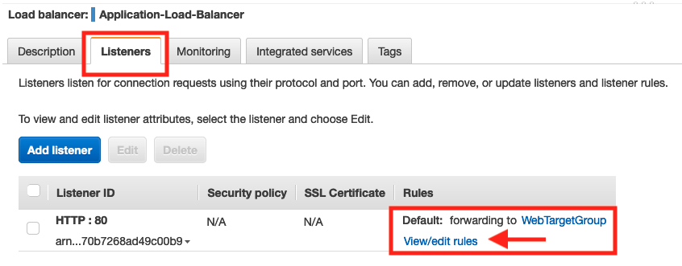
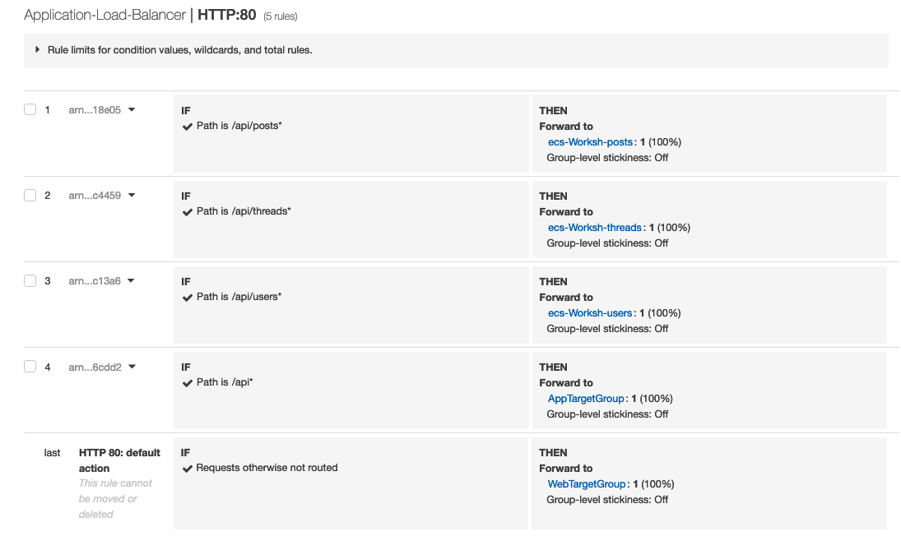

+++
title = "Modernize the monolith"
weight = 10
+++

#### What are we going to do?
In this section we will break the monolithic application into microservices using combination of CloudFormation and AWS management console. The CloudFormation template will create the base infrastructure for microservices like ECS cluster, ECS task definitions, Amazon Elasticache Redis, Amazon Relational Database using MySQL, Amazon S3, and CloudFront.

#### We are going to perform the following steps:

* Deploy CloudFormation template to create microservices infrastructure.
* Create Fargate Service for three microservices posts, users, threads.
* Move Frontend web static assets to Amazon S3 and point CloudFront to this S3.


### Step 1: Deploy Micro-services infrastructure using Cloud Formation.


* You can use Cloud9 environment to deploy the CloudFormation using CLI command below

- Navigate to the CloudFormation file

```
cd ~/environment
cd moving-up-stack-workshop/resources/code/scenario1/templates/
```
* Then run the below CLI command
```
aws cloudformation deploy \
   --template-file scenario1_infrastructure.yml \
   --region ${AWS_DEFAULT_REGION} \
   --stack-name DecoupletoMicroservices \
   --parameter-overrides NetworkStackParameter=Monolith Database=mydb \
   --capabilities CAPABILITY_NAMED_IAM
```

{}
it takes approximatey 10 mins to deploy the mircoservices architecture. You can start to run the CloudFormation template and explore the architecture overview in the mean time.
{}

### Architectural Overview

* This is the process that you will follow to deploy the microservices and safely transition the application's traffic away from the monolith.



  
### Step 2: Verify of the AWS ECS Fargate Cluster is created

* Navigate to the [Amazon ECS console](https://console.aws.amazon.com/ecs/home?). Your cluster should appear in the list


* Verify the posts, threads, and users microservice **Task Definitions** were created.

* Navigate to Task Definitions tab on left side and verify that the tasks are ACTIVE


### Step 3: Create Fargate Service

* Navigate to Cluster tab on the left side and select **Workshop-MovingUpTheTechStack** → **Services→Create**


- Choose Launch type: **Fargate**
    * Operating system family: choose **Linux** from the dropdown
    * Task Definition: under dropdown choose *posts*
    * Revision: 1 (latest)
    * Platform version: LATEST
    * Cluster: **Workshop-MovingUpTheTechStack**
    * Service name: **posts**
    * Number of task: 1
    * Scroll down, keep all other setting to default
    * Choose **Next step**
- Under Configure network
    * Cluster VPC: From the dropdown select the **(10.0.0.0/16) | movingupstack vpc**
    * Subnets: choose **Private Subnet One and Private Subnet Two**
    * Security groups: Edit→Select Existing Security Group→ select **Container Security Group** → *Save*
    * Auto-assign public IP: choose **DISABLED**
    * Scroll down to Load Balancing → choose Application Load Balancer
        * verify Load balancer name is **Application-Load-Balancer** from the drop-down 
            * Note: Hit refresh button if you don’t see the load balancer name
    * Container to load balance: → choose posts 5000:5000 and click **Add to load balancer**



- In this step we are configuring Application Load balancer settings
    * Under posts : 5000
        * Production listener port: from the dropdown select **80:HTTP**
        * Target group name: select Create new and keep the default name
        * Path pattern: enter **/api/posts\*** with Evaluation Order **2**
        * Health check path: enter **/api/posts/health**


* Click **Next step**
* Keep default setting for Set Auto Scaling → Click **Next step** and Review the configuration
* Click **Create Service**
* Click **View Service**

- Please repeat the same steps for two other microservices *threads* and *users* with increments to the Evaluation Order (threads=3, users=4) Once you created all three ECS services your ECS cluster should have services as shown below.

* It should only take a few seconds for all your services to start. Ensure the  *Status* for all the services are *ACTIVE* as shown in the above screenshot. 
* Switch to the *Tasks* tab next to the *Services* tab and ensure the Last Status column for all the tasks is in *RUNNING* state as shown below




### What did you do?

* You deployed three microservices *posts*, *threads* and *users* onto AWS ECS Fargate cluster 
* Deployed ECS Fargate Service behind the same Application Load Balancer that is being used by the monolith application.

### What will you do next? 

**Switch over traffic from Monolith to Microservices**

> Right now, all four of your services (monolith and your three microservices) are running behind the same load balancer. However, all traffic is still flowing to your monolith service. To make the migration from monolith to microservices, you will start routing the traffic to your microservices and stop routing traffic to your monolith.

### Step 4: Edit Application Load Balancer Listener rules

* Navigate to the Load Balancer section of the [EC2 Console](https://console.aws.amazon.com/ec2/v2/home?#LoadBalancers:).
* Locate the Load Balancer named **Application-Load-balancer** and select the checkbox next to it to see the Load Balancer details.
* Select the **Listeners** tab.
* Click on **view/edit rules**

* Under the **Rules** column, select **Reorder rules** rules.
* Select Rule 1 (Path is/api*) and lower down the priority to Rule 4 by clicking on the Bottom arrow 
  * *Note*: This will make sure the requests are routed to the microservices and application is working as expected, before you delete the route to the monolith.
* See the following screenshot for an example of the updated rules.



### What did you do?

* You have now fully transitioned backend service from the monolith to microservices, without any downtime!

### What will you do next? 

* Upload Amazon S3 bucket with Static Frontend content which is configured as origin to Amazon CloudFront. 
* Update Amazon CloudFront to point to Amazon S3 endpoint with origin access identity so you get the same user experience as the monolith.

### Step 5: Navigate to the static content

```
cd ~/environment/moving-up-stack-workshop/resources/code/scenario0/webapp

```

Run the below script to package the static content, upload it to Amazon S3.
In this example, we are using Cloudfront to server the content.

```
npm install
npm run build
cd dist

S3_BUCKET_NAME=$(aws cloudformation describe-stacks \
                --stack-name DecoupletoMicroservices \
                --query "Stacks[0].Outputs[?OutputKey=='S3BucketName'].OutputValue" \
                --output text)
API_URL_VALUE=$(aws cloudformation describe-stacks \
                --stack-name Monolith \
                --query "Stacks[0].Outputs[?OutputKey=='LoadBalancerUrl'].OutputValue" \
                --output text)
CLOUDFRONT_URL=$(aws cloudformation describe-stacks \
                --stack-name DecoupletoMicroservices \
                --query "Stacks[0].Outputs[?OutputKey=='CloudFrontDomainName'].OutputValue" \
                --output text)
path="./js/"
FILE_NAME=$(ls ${path} | grep -m 1 app.)
sed -i "s|http://localhost:5000|https://${CLOUDFRONT_URL}|g" "${path}${FILE_NAME}"
aws s3 sync . s3://${S3_BUCKET_NAME}
echo https://${CLOUDFRONT_URL}
```

- Copy the CloudFront URL and paste it in the browser to view the WebApp application


### In this section you modernized your AWS infrastructure by decouplnig to microservices, moved to managed services such as Amazon RDS and used Amazon S3 to host static web content.

> ### In the next section we will move up this stack and see how to modernize the infrastructure to give developers an easy way to deploy their code using containers and serverless technologies, leveraging the management tools, governance, and visibility needed to provide consistent standards and best practices.