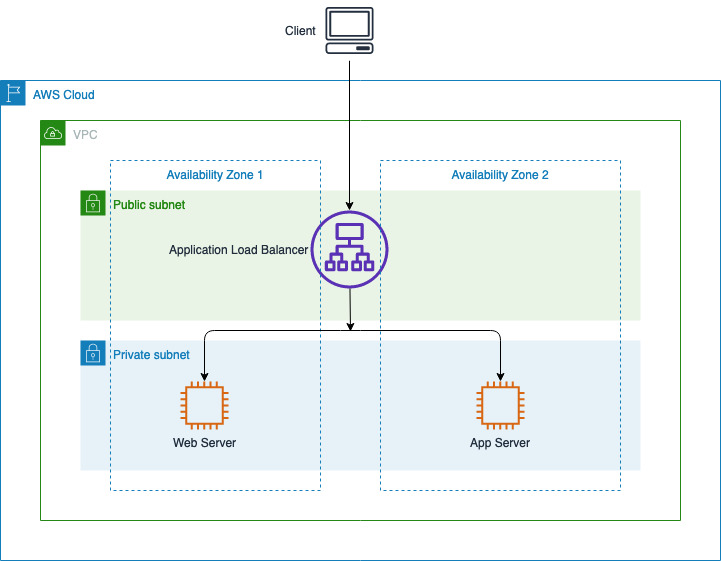
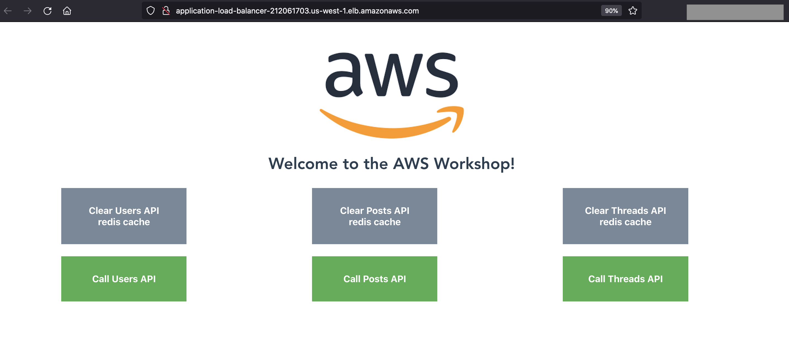

+++
title = "Monolith Application"
weight = 5
+++

#### What are we going to do?
In this section we will provision the monolith web architecture consisting of AWS Application Load Balancer and two EC2 instances *Webserver* and *Appserver* running containers for frontend, application, Redis cache and MySQL database.


#### Step-by-step guide
* Start by logging into your Cloud9 workstation.
* Clone the repository and open the folder.

```
cd ~/environment
git clone https://github.com/aws-samples/moving-up-stack-workshop
cd moving-up-stack-workshop
```

* Navigate to CloudFormation file and deploy the CloudFormation template scenario0_infrastructure.yml

```
cd ~/environment
cd moving-up-stack-workshop/resources/code/scenario0/templates/
```
* Then run the below CLI command

```
aws cloudformation deploy --template-file scenario0_infrastructure.yml --region ${AWS_DEFAULT_REGION} --stack-name Monolith --capabilities CAPABILITY_NAMED_IAM
      
```

* It may take around 5-6 mins to successfully deploy the CloudFormation template. In the meantime you can explore the architecture below.

{}
***Troubelshooting***
You can navigate to the [AWS CloudFormation console](https://console.aws.amazon.com/cloudformation/home), Click on the stack named **Monolith** and go to **Events** tab to understand the error if any while deploying the template.
{}


#### Architecture.



#### Explore Monolith application.

* Navigate to the [AWS CloudFormation console](https://console.aws.amazon.com/cloudformation/home).
* Click on the stack named **Monolith** and go to **Outputs** tab 

* Select the **Application Load Balancer** link to open in a new tab.


* Explore the monolith application and click on the tabs posts, threads and users. 
    * Observe the changes with multiple clicks.
    * Clear Redis cache for each API calls and call the APIs again. 
        * *Observation*:  the initial request for each API call is cached by the in-memory database Redis

{}
While accessing the load balancer url, if you are getting error message **502 Bad gateway** , wait for a minute for the EC2 instance to launch the container and register it to the load balancer. Refresh the load balancer url in the browser until you see the web application.
{}

