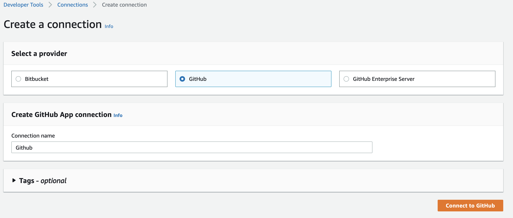
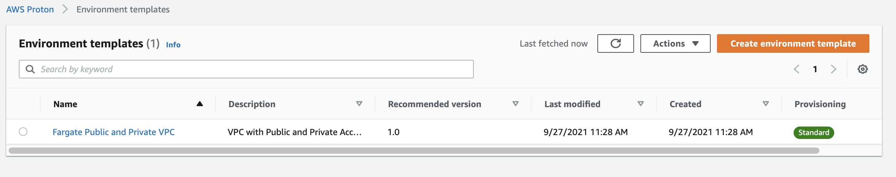
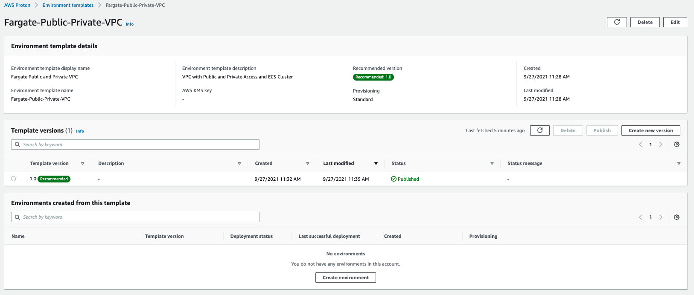
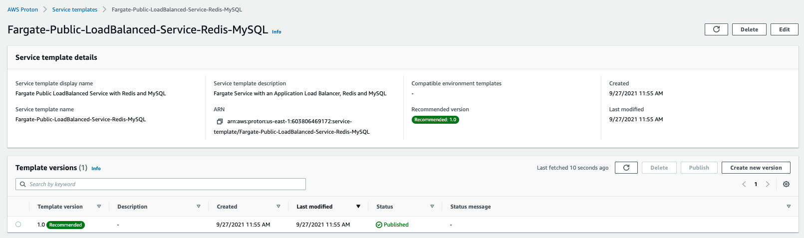

+++
title = "Create Proton Templates"
weight = 5
+++

## What are we going to do?
In this section we'll use the aws cli to configure proton templates for our environment and microservices.

## Step by step guide

Start by logging into your Cloud9 workstations.

<!--
Clone the repository and open the folder.

```
cd ~/environment
git clone git@ssh.gitlab.aws.dev:diegodal/workshop-movingupstack.git
cd workshop-movingupstack/resources/code/scenario2/loadbalanced-fargate-redis-mysql/
```
-->

Set your default variables

```bash
export AWS_DEFAULT_REGION=$(curl -s 169.254.169.254/latest/dynamic/instance-identity/document | jq -r '.region')
export ACCOUNT_ID=`aws sts get-caller-identity --query Account --output text`

```

Next, we'll navigate to our template folder.

```bash
cd ~/environment/workshop-movingupstack/resources/code/scenario2/loadbalanced-fargate-redis-mysql/
```


### Configure IAM Role, S3 Bucket, and CodeStar Connections Connection

Before you register your templates and deploy your environments and services, you will need to create an Amazon IAM role so that AWS Proton can manage resources in your AWS account, an Amazon S3 bucket to store your templates, and a CodeStar Connections connection to pull and deploy your application code.

Create the S3 bucket to store your templates:

```bash
CONSTRAINT_ARGS="--region ${AWS_DEFAULT_REGION} --create-bucket-configuration LocationConstraint=${AWS_DEFAULT_REGION}"
if [[ "${AWS_DEFAULT_REGION}" == "us-east-1" ]]; then CONSTRAINT_ARGS="" ; fi

aws s3api create-bucket --bucket "proton-cli-templates-${ACCOUNT_ID}-${AWS_DEFAULT_REGION}" "${CONSTRAINT_ARGS}"
```

Create the IAM role that Proton will assume to provision resources and manage AWS CloudFormation stacks in your AWS account.

```bash
aws iam create-role \
  --role-name ProtonServiceRole \
  --assume-role-policy-document file://./policies/proton-service-assume-policy.json

aws iam attach-role-policy \
  --role-name ProtonServiceRole \
  --policy-arn arn:aws:iam::aws:policy/AdministratorAccess
```

Then, allow Proton to use that role to provision resources for your services continuous delivery pipelines:

```bash
aws proton update-account-settings \
  --pipeline-service-role-arn "arn:aws:iam::${ACCOUNT_ID}:role/ProtonServiceRole"
```

{}
***What did we just do?***
We just created an S3 bucket in our account.
Then we created an IAM Role for Proton and gave the service permission to use it.
{}

## Create a CodeStar Connection

AWS Proton uses CodeStar Connections to connect to  your application code stored in a GitHub source code repository.  
This connection allows CodePipeline to pull your application source code before building and deploying the code to your Proton service.
To complete this section, you will need a free tier Github Account.
You should also be comfortable forking Github Repositories. 
Navigate to [CodeStar Connections console](https://console.aws.amazon.com/codesuite/settings/connections?home?#Home)
to create a new source code connection.

{}
***Region Matters***
Please make sure you are in the correct region when creating the CodeStar Connection. 
{}

Next click on create connection. 
Select GitHub, and give the connection a name of `Github`. 
Then click on Connect to GitHub.



On the next screen choose install new app.
If necessary login to your GitHub account. 
Follow the prompts to grant CodeStar permission to your GitHub repositories.

{}
***If you get stuck***
Please ask a moderator for help or review the [CodeStar Connection documentation](https://docs.aws.amazon.com/dtconsole/latest/userguide/connections-create-github.html#connections-create-github-cli). 
{}


Finally before proceeding, fork the following GitHub repositories to your account.
If you need more information on how to fork a repository, please see [this link](https://docs.github.com/en/get-started/quickstart/fork-a-repo)

- [workshop-movingupstack-api-posts](https://github.com/dchristian3188/workshop-movingupstack-api-posts)
- [workshop-movingupstack-api-threads](https://github.com/dchristian3188/workshop-movingupstack-api-threads)
- [workshop-movingupstack-api-users](https://github.com/dchristian3188/workshop-movingupstack-api-users)

## Register an Environment Template

In this section we start uploading our first template to Proton.
This template is an environment template that will provision our VPC with 4 subnets (2 public, 2 private), an ECS Cluster, and Application Load Balancer.

First, create an environment template, which will contain all of the environment template's versions.

```bash
  aws proton create-environment-template \
  --name "Fargate-Public-Private-VPC" \
  --display-name "Fargate Public and Private VPC" \
  --description "VPC with Public and Private Access and ECS Cluster"
```

Now create a version which contains the contents of the sample environment template. Compress the sample template files and register the version:

```bash
tar -zcvf far-pubpriv-env-template.tar.gz environment/

aws s3 cp far-pubpriv-env-template.tar.gz s3://proton-cli-templates-${ACCOUNT_ID}-${AWS_DEFAULT_REGION}/far-pubpriv-env-template.tar.gz

rm far-pubpriv-env-template.tar.gz

aws proton create-environment-template-version \
  --template-name "Fargate-Public-Private-VPC" \
  --source s3="{bucket=proton-cli-templates-${ACCOUNT_ID}-${AWS_DEFAULT_REGION},key=far-pubpriv-env-template.tar.gz}"
```

{}
If you like to examine the details of the template, take a look at the Cloudformation in the "~/environment/workshop-movingupstack/resources/code/scenario2/loadbalanced-fargate-redis-mysql/environment" folder.
{}

You can now publish the environment template version, making it available for users in your AWS account to create Proton environments.

```bash
aws proton update-environment-template-version \
  --template-name "Fargate-Public-Private-VPC" \
  --major-version "1" \
  --minor-version "0" \
  --status "PUBLISHED"
```

{}
***What did we just do?***
We just created a Proton environment template.
Open the Proton console and check that your new template is created. 
{}

Let's see the environment template that we just created.
Open the [Proton Console](https://console.aws.amazon.com/proton/home?).
From the menu on the left click Environment templates under Templates.
Click on the newly created "Fargate Public and Private VPC" template.



When you open the template to see more details, your template should look something like below:



## Register the Service Templates

Next we're going to register the services templates, which contains all the resources required to provision an ECS Fargate services behind a load balancer, a dedicated ElastiCache cluster, an RDS instance as well as a continuous delivery pipeline using AWS CodePipeline for each.

Start by creating the service template.

```bash
  aws proton create-service-template \
  --name "Fargate-Public-LoadBalanced-Service-Redis-MySQL" \
  --display-name "Fargate Public LoadBalanced Service with Redis and MySQL" \
  --description "Fargate Service with an Application Load Balancer, Redis and MySQL"
```

Now create a version which contains the contents of the sample service template. Compress the sample template files and register the version:

```bash
tar -zcvf farRedMy-svc-template.tar.gz service/

aws s3 cp farRedMy-svc-template.tar.gz s3://proton-cli-templates-${ACCOUNT_ID}-${AWS_DEFAULT_REGION}/farRedMy-svc-template.tar.gz

rm farRedMy-svc-template.tar.gz

aws proton create-service-template-version \
  --template-name "Fargate-Public-LoadBalanced-Service-Redis-MySQL" \
  --source s3="{bucket=proton-cli-templates-${ACCOUNT_ID}-${AWS_DEFAULT_REGION},key=farRedMy-svc-template.tar.gz}" \
  --compatible-environment-templates '[{"templateName":"Fargate-Public-Private-VPC","majorVersion":"1"}]'
```

{}
If you like to examine the details of the template, take a look at the Cloudformation in the "~/environment/workshop-movingupstack/resources/code/scenario2/loadbalanced-fargate-redis-mysql/service" folder.
{}

You can now publish the Public service template version, making it available for users in your AWS account to create Proton services.

```bash
aws proton update-service-template-version \
  --template-name "Fargate-Public-LoadBalanced-Service-Redis-MySQL" \
  --major-version "1" \
  --minor-version "0" \
  --status "PUBLISHED"
```

{}
***What did we just do?***
We just created a Proton service template.
Open the Proton console and check that your new template is created. 
{}

Lets see the service template that we just created.
Open the [Proton Console](https://console.aws.amazon.com/proton/home?).
From the menu on the left click Service templates under Templates.
Click on the newly created "Fargate Public LoadBalanced Service with Redis and MySQL" template.


Your template should look something like below:



Continue to the next section to provision an environment from this template.