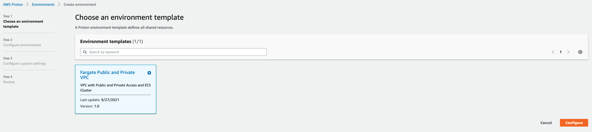
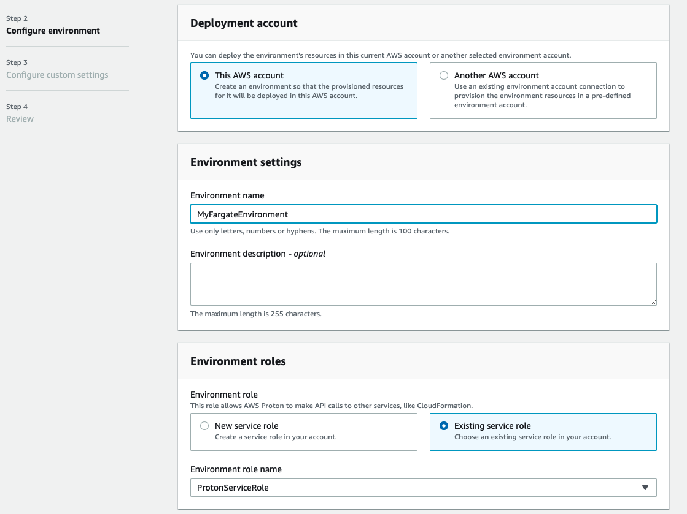
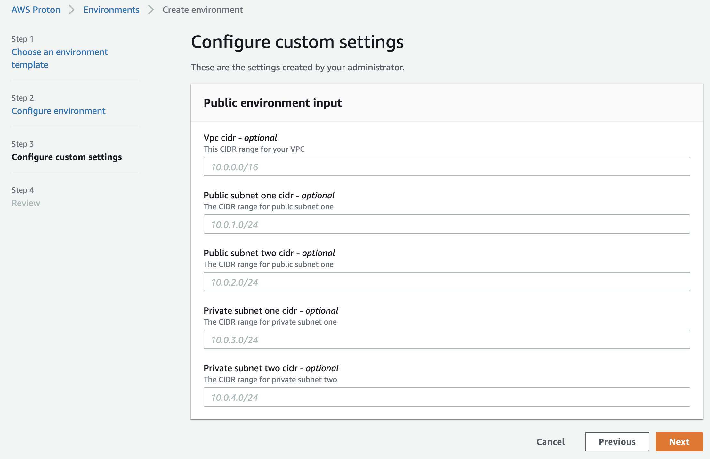

+++
title = "Create Proton Environment"
weight = 10
+++

---

## What are we going to do?
In this section we will provision the environment for our microservices.
This environment will include a VPC with public and private subnets, an ECS Cluster, and the shared Application Load Balancer.

## Step by step guide


With the registered and published environment template, you can now create a Proton environment from the template.

Open the [Proton Console](https://console.aws.amazon.com/proton/home#/environments).
Click on ```Create environment```

Choose the ```Fargate Public and Private VPC``` template we created in the previous step and then click ```Configure```.



On the ```Configure Environment``` screen.
 - Give the environment a name of ```MyFargateEnvironment```.
 - Under environment roles, choose existing service role and select ```ProtonServiceRole```

Then click the ```Next``` button.



Leave on the defaults on the ```configure custom settings``` screen and click ```Next```.



Finally on the ```Review``` screen, click ```Create```.
Wait a few minutes for your environment to be created.

{}
***What did we just do?***
We just used our Proton environment template to create an environment.
{}
