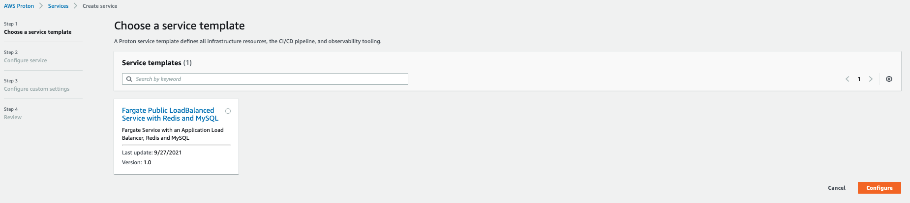
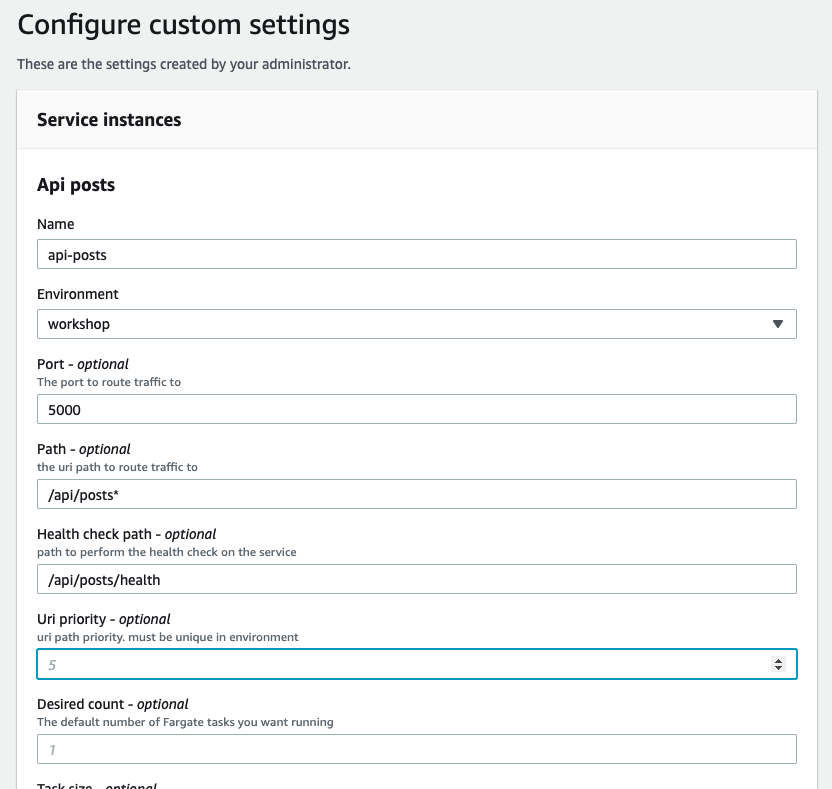

+++
title = "Review the Pipelines"
weight = 20
+++

## What are we going to do?
In this section we will review the piipeliines created by Proton. 

## Step by step guide

With the registered and published service template and deployed environment, you can now create a Proton service and deploy it into your Proton environment.
Open the [Proton Console](https://console.aws.amazon.com/proton/home#/services).
Click on ```Create service```

Choose the ```Fargate Public LoadBalanced Service with Redis and MySQL``` template we created in the previous section and then click ```Configure```.



On the ```Configure service``` screen.
 - Give the service a name of ```api-posts```.
 - Under service repository settings use:
    - Repository Connection: ```Github```
    - Repository ID: ```moving-up-stack-workshop-apis```
    - Branch Name: ```posts```


Then click the ```Next``` button.


On the ```Configure Custom Settings``` screen configure the below settings. 
- Name: ```api-posts```
- Environment: Select ```MyFargateEnvironment```
- Port: `5000`
- Path: `/api/posts*`
- Health check path: `/api/posts/health`
- Uri priority: `5`

Feel free to adjust any of the other optional parameters. 



Click ```Next```. 
Finally on the ```Review``` screen, click ```Create```.
Wait a few minutes for your service and pipeline to be created.

{}
***What did we just do?***
We just used our Proton template to deploy the posts microservice.
{}

### Deploy Our Remaining Services

We just walked through how to create a proton service with the console, but we can also do the same thing from the cli. 
What we'll do next is deploy our two other remaining services from the previous section. 

Start by creating a new proton spec file.
This spec file has all the inputs proton needs to create a service.
From your Cloud9 workspace, run the below command to create the spec file.


```bash
cat <<EOF > api-threads.yaml
---
proton: "ServiceSpec"
pipeline:
  dockerfile: "Dockerfile"
  unit_test_command: "echo 'add your unit test command here'"
  environment_account_ids: ""
instances:
- name: "api-threads"
  environment: "MyFargateEnvironment"
  spec:
    port: 5000
    path: "/api/threads*"
    health_check_path: "/api/threads/health"
    uri_priority: 15

EOF
```

With our spec file in place, we can create a new service. 
Start by finding the ARN of the code star connection you created earlier. 

```bash
CONNECTION_NAME=Github
CONNECTION_ARN=$(aws codestar-connections list-connections \
	--query 'Connections[?ConnectionName==`'"${CONNECTION_NAME}"'`]' \
	| jq --arg AWS_DR "${AWS_DEFAULT_REGION}" '.[] | select(.ConnectionArn | contains($AWS_DR))' \
	| jq -r .ConnectionArn)
```

```bash
aws proton create-service \
  --name "api-threads" \
  --repository-connection-arn ${CONNECTION_ARN} \
  --repository-id "moving-up-stack-workshop-apis" \
  --branch "threads" \
  --template-name Fargate-Public-LoadBalanced-Service-Redis-MySQL \
  --template-major-version 1 \
  --spec file://api-threads.yaml
```

Check the proton console. 
You should see the new service deployed. 
Finally, complete the process one last time to deploy the 'users' microservice.

```bash
cat <<EOF > api-users.yaml
---
proton: "ServiceSpec"
pipeline:
  dockerfile: "Dockerfile"
  unit_test_command: "echo 'add your unit test command here'"
  environment_account_ids: ""
instances:
- name: "api-users"
  environment: "MyFargateEnvironment"
  spec:
    port: 5000
    path: "/api/users*"
    health_check_path: "/api/users/health"
    uri_priority: 20

EOF

aws proton create-service \
  --name "api-users" \
  --repository-connection-arn ${CONNECTION_ARN} \
  --repository-id "moving-up-stack-workshop-apis" \
  --branch "users" \
  --template-name Fargate-Public-LoadBalanced-Service-Redis-MySQL \
  --template-major-version 1 \
  --spec file://api-users.yaml
```

Review the services in the proton console to see our microservices deployed.
Please note that it can take up to 15 minutes for all services to finish deploying. 

{}
***What did we just do?***
We just used the AWS Proton cli to deploy the threads and users microservices.
{}